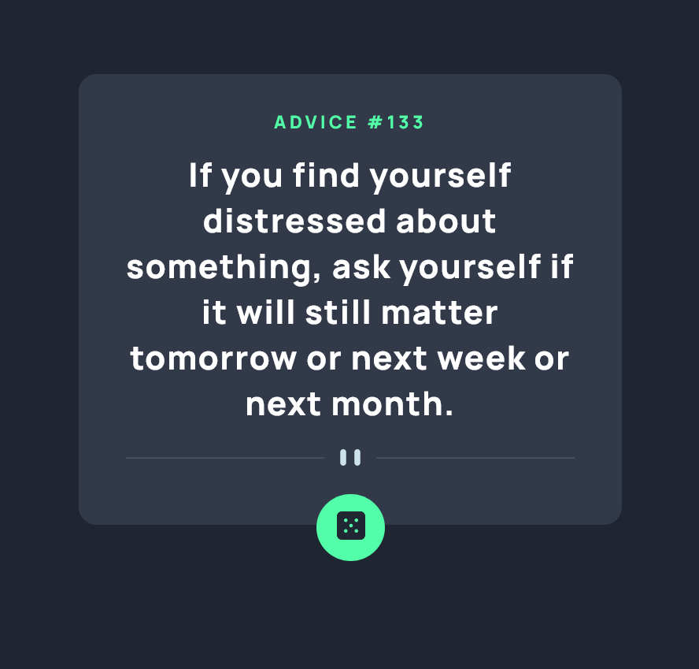

# Frontend Mentor - Advice generator app solution

This is a solution to the [Advice generator app challenge on Frontend Mentor](https://www.frontendmentor.io/challenges/advice-generator-app-QdUG-13db). Frontend Mentor challenges help you improve your coding skills by building realistic projects.

## Table of contents

- [Overview](#overview)
  - [The challenge](#the-challenge)
  - [Screenshot](#screenshot)
  - [Links](#links)
- [My process](#my-process)
  - [Built with](#built-with)
  - [What I learned](#what-i-learned)
- [Author](#author)


## Overview

### The challenge

The challenge is to build out this advice generator app using the [Advice Slip API](https://api.adviceslip.com) and get it looking as close to the design as possible.

Users should be able to:

- View the optimal layout for the app depending on their device's screen size
- See hover states for all interactive elements on the page
- Generate a new piece of advice by clicking the dice icon

- 

### Screenshot




### Links

- Solution URL: [Add solution URL here](https://your-solution-url.com)
- Live Site URL: [Add live site URL here](https://your-live-site-url.com)

## My process

### Built with

- Semantic HTML5 markup
- CSS custom properties
- Flexbox
- Mobile-first workflow
- JavaScript


### What I learned

Use this section to recap over some of CSS $ JavaScript while working through this project. 


```css
.card{
    background: hsl(217, 19%, 24%);
    max-width: 400px;
    margin: 0 auto;
    text-align: center;
    padding: 30px;
    border-radius: 15px;
    position: relative;
}

.btn{
    position: absolute;
    left: 50%;
    transform: translateX(-50%);
    bottom: -30px;
    background: hsl(150, 100%, 66%);
    border: none;
    padding: 15px 17px;
    border-radius: 50%;
    cursor: pointer;
}
```
```js
const fetchAdvice = () =>{
    fetch(url).then(response =>{
    return response.json()
}).then(adviceData=>{
    adviceId.textContent = adviceData.slip.id;
    adviceText.textContent = adviceData.slip.advice
}).catch(error => console.log(error))}
```

## Author

- Name - [Shahila]
- GitHub - [Shahila1990](https://github.com/Shahila1990)
- Frontend Mentor - [@Shahila1990](https://www.frontendmentor.io/profile/Shahila1990)

